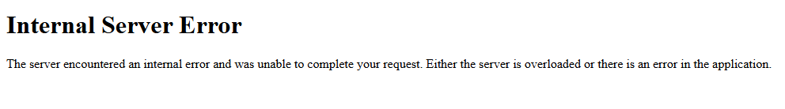
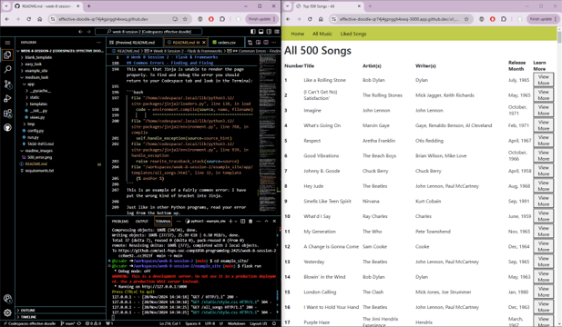

# Week 8 Session 2 - Flask & Frameworks

## Basic Setup

Flask has a number of necessary libraries to install, which are external.

To save time, a list of these in included in `requirements.txt`.

You can install them all at once using:
```
pip install -r requirements.txt
```
You only need to do this once per codespace.

## Running a Flask Site

**You will need to use the command line to run your Flask site**.

The steps are simple:
1. cd to the folder containing 'run.py' in the site you want to run (use `ls` to check if you're having trouble)
2. type the following command: `python -m flask run --debug`

This will run the current flask site - you should see something like:

```bash
@Scsabr ➜ /workspaces/week-8-session-2/blank_template (main) $ python -m flask run --debug
 * Debug mode: on
WARNING: This is a development server. Do not use it in a production deployment. Use a production WSGI server instead.
 * Running on http://127.0.0.1:5000
Press CTRL+C to quit
```

You will get a pop-up which lets you open your site in the browser - click on this and it will open your site in a new tab. If you accidentally click off this, you can copy and paste the URL shown in the terminal (`http://127.0.0.1:5000` in the example above).

However - you will see a normal python error if your code contains issues. You will also see an error if your code gets a 500 error at any point. These are very useful for debugging - it can be useful to split your screen so you can see both the code and the terminal, and your site.

## The Folder Structure

Flask has a strict folder structure which you need to use:
```
.
├── app
│   ├── static
│   │   ├── song_data.csv
│   │   └── style.css
│   ├── templates
│   │   ├── base.html
│   │   ├── home.html
│   ├── __init__.py
│   └── views.py
├── config.py
├── run.py
└── tmp
```

**Note: When you run your code, you will get pycache folders - you can ignore these. They are python pre-compiling bits of your code to make it run faster!**

### The app/ folder

Contains the files and folders which make up your web app:
- `__init__.py` - this creates your app when you run Flask
- `views.py` - this is the controller for your site, and is where you will write most of your code.
- `static/` - this folder should be used to hold anything which should have a fixed (static) url - for example, css files, csv files, images and other media. You can create sub-folders in here if you want to make it more organised.
- `templates/` - this holds all of your Jinja templates.

The `app/` folder and subfolders are where you will be working.

### config.py / run.py

`config.py` is where some useful set-up is done.

```python
import os

basedir = os.path.abspath(os.path.dirname(__file__))

WTF_CSRF_ENABLED = True
SECRET_KEY = 'a-very-secret-secret'
```

It is setting up the root path using the `os` library, and then setting up some security features. You can change the SECRET_KEY if you want!

And `run.py` is telling Flask how to run our code:

```python
from app import app

app.run(debug=True)
```

In this case, it's importing the `app` which is created in `__init__.py`, and then running it.

---

### Basics of Flask

You will primarily be working in two places in Flask:

- Templates - the HTML templates where you use Jinja to use data in your site
- views.py - this is where you define your routes to make new pages, as well as doing any python processing

Views.py is in standard python, and you can import and use any libraries which you are used to.

Templates use HTML and Jinja - a lot of Jinja is identical to Python, but you will sometimes find differences. For example, to get the length of a data structure in Python you use `len(data)` whereas in Jinja it is `data|length`.

If you are not familiar with HTML, it is a web markup language - it's pretty useful to know a little bit of, and you can find the very basics [here](https://www.w3schools.com/html/).

The main things to remember are:
- close every tag you open `<h1> like this </h1>`
- don't worry too much about how it looks!

CSS is used to style your site - in all examples, Bootstrap (a CSS library) is being used. If you want to do some more interesting formatting and are familiar with HTML and CSS, the Bootstrap docs show you how to use everything [here](https://getbootstrap.com/docs/4.1/components/buttons/).

If you are struggling with HTML or CSS, you can find generators to make a lot of it for you - a particularly good source for this is [CSS Portal](https://www.cssportal.com/) which will produce CSS and HTML for things like navigation bars.


## Some useful bits of code

### Paths and Flask

Because when you run your code it's not always clear *where* you're running it from, working out relative file paths can be difficult.

To get around this, we can use the `os` library to create our paths:

```python
import os

# This creates a path which joins, in order, the app's route path, the static folder, and the products.csv file
os.path.join(app.root_path, 'static', 'products.csv')
```

In your site, you may also need to use the `url_for()` function:

```python
# this will put the currect url for whatever route is called 'index' in the views.py file
url_for("index")

# this also works where you need to pass some other data:
url_for("product", id=6)

# this puts the correct url for the static folder, followed by the filename which is made up of the images subfolder and the filename located in a datastructure.
url_for('static', filename=('images/'+product[4]) )
```

This works both in your views.py and when surrounded by {{ }}s in Jinja.


### Jinja - Loops, Conditions, Data Structures

Jinja2, our templating language, is very similar to python but has some slight differences.

You can get the full docs from [here](https://jinja.palletsprojects.com/en/stable/templates/#synopsis) which show everything you might want to include.

There are 3 important things to remember:
- Constructs such as loops and conditions go inside braces with percentages: , 
- To print out data, you need to surround it with double braces: {{ name }}, {{ data_structure[1] }}
- all your template code needs to be between  and !

When you run your site, Jinja will glue together all the bits of code into one HTML page for you:

```html
<!-- This tells Jinja 'go and find base.html - we are using that as our base code -->

<!-- This tells Jinja to put this section inside    in the base code file -->
 
 
     <h1>Hello Worls</h1>

<!-- and this tells it that we have finished making our code block -->
 
```

#### For Loop
```html

     <h1>{{ item }}</h1>



    <ul>{{ i }}</ul>

```
Because we can't rely on indentation for scope, Jinja requires you to terminate loops and conditional statements.

`for` can iterate through iterable data structures (lists, dictionaries, etc) or you can use a counted for loop.

#### If statements
```html

    <p>Out of Stock</p>

    <p>{{ data["stock_level"] }} in Stock</p>

```

If statements also need to be terminated with an `endif` - you can use else and elif just like in normal Python.

#### Data Structures

```html
<!-- When you're using data to create a tag, you will need to ensure it has " " around it. If you need to use parentheses because you have a dict, use singles instead of doubles to prevent them from interacting -->


<!-- If you're just printing the data inside a tag, you just need the brackets - no parentheses! -->
<p>{{ data["name"] }}</p>

<!-- or if it's just a variable -->
<h2>{{ page_title }}</p>

<!-- you can also use functions such a url_for() which can be very useful for dynamically creating links -->
<a href="{{ url_for('static', filename='images/' + product['image_url']) }}">this also works</a>
```

Jinja is able to handle standard data structures, for example lists, dicts, and data such as ints, strings and so on. It can also handle nested data- lists-of-lists, lists-of-dicts etc. and you can index these exactly as you would in Python.

You can use Jinja to get data out of a structure in any part of your template - to put text onto your site, or to do things such as dynamically insert images as shown above.

Just remember- **you have to pass the data into the template in the render_template() call in views.py**.


## Common Errors - Finding and Fixing

When you get an error, you may see a page which looks like:



This means that Jinja is unable to render the page properly. To find and debug the error you should return to your Codespace tab and look in the Terminal:

```bash
  File "/home/codespace/.local/lib/python3.12/site-packages/jinja2/loaders.py", line 138, in load
    code = environment.compile(source, name, filename)
           ^^^^^^^^^^^^^^^^^^^^^^^^^^^^^^^^^^^^^^^^^^^
  File "/home/codespace/.local/lib/python3.12/site-packages/jinja2/environment.py", line 768, in compile
    self.handle_exception(source=source_hint)
  File "/home/codespace/.local/lib/python3.12/site-packages/jinja2/environment.py", line 939, in handle_exception
    raise rewrite_traceback_stack(source=source)
  File "/workspaces/week-8-session-2/example_site/app/templates/all_songs.html", line 32, in template
    {% endfor %)
```
This is an example of a fairly common error: I have put the wrong kind of bracket into Jinja. The errors here could either be in your template OR in your views.py - you may need to check both if you cannot see the error.

Just like in other Python programs, read your error log from the bottom up.

If you don't understand what the error means, search it in Google or ask a generative AI model to explain what it means [as they are good at explaining them!](https://chatgpt.com/share/673df30f-e5a0-800c-af35-723496cafd2f).

To make it easier to debug code, it is recommended to split your screen so you can see both the terminal and your website at once:


## 'I already know this'

If you can use Flask like a pro already, then 'blank_template' contains the necessary directory layout for you to produce your own site with none of my site code. All the basic setup is there, all you need to do is create some content.

I would recommend looking at:
- implementing a relational database using sqlalchemy and migrations (flask-sqlalchemy, flask-migrate)
- creating a secure login system (flask-login)
- trying out some interesting APIs to pull some data from online.

You will need more flask libraries for this - you can pip install them yourself.

You could make:
- a proper store with an admin side and a customer side, allowing users to make orders and admins to view orders
- a book/film/music review site
- a mini social media site, with a friends system, posts, and comments

If you want some help, get stuck, or need a guide: [DigitalOcean have a wide array of Flask guides](https://www.digitalocean.com/community/tutorials/how-to-use-web-forms-in-a-flask-application)
